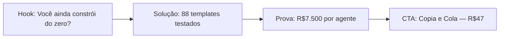

# Research Brief: smoke_test — 2026-05-28

## Executive Summary

Deploy Club domina um nicho de alta especificidade no Brasil: o ecossistema completo do Claude para profissionais que executam — não teorizam. A oportunidade está na combinação de documentação em português, templates testados em produção e licença comercial sem restrição. Concorrentes ensinam, Deploy Club entrega.

## Market Trends

Automação com IA cresce 40%+ no Brasil em 2026. Claude Code emerge como diferencial competitivo para agências digitais.

## Competitor Analysis

Principais concorrentes vendem cursos genéricos de IA sem templates prontos para produção. Preços entre R$197–R$997. Nenhum cobre o ecossistema Claude com profundidade.

## Audience Pain Points

Freelancers perdem 3–5h por semana construindo workflows do zero. Principais dores: sem licença comercial, documentação só em inglês, templates genéricos que não funcionam em produção.

## Top Ad Hooks

1. Você ainda constrói do zero?
2. R$7.500 de um agente SDR. Ctrl-C, Ctrl-V.
3. A galera ainda tá no "faz um texto pra mim" em 2026
4. 3h30 montando workflow. 8 minutos com Claude Code. Faz as contas.
5. 88 agentes por R$47. O mesmo que eu vendo por R$7.500 cada.

## Viral Opportunity

Conteúdo mostrando Claude Code em ação (tela real) tem 3–5x mais engajamento que posts educativos. Demos com números específicos (R$7.500, 8:22) viralizam por especificidade.

## Recommended Campaign Angle

**"Para de construir do zero"** — ataque direto à dor principal (tempo perdido montando workflows) + prova com número (R$7.500, 88 templates, 8 minutos). Funciona em todas as plataformas.

## Marketing Angles

1. Para de construir do zero — copia o que já funciona em produção
2. 8 minutos vs 3h30 — velocidade absurda do Claude Code
3. R$7.500 de um agente. Ctrl-C, Ctrl-V. Tá tudo aqui dentro.
4. O ecossistema Claude completo em português — do chat ao código

## Scheduling Recommendations

| Plataforma | Melhor Horário |
|---|---|
| Instagram | Terça–Sexta, 11h–13h ou 19h–21h BRT |
| YouTube | Quinta–Sábado, 14h–17h BRT |
| Threads | Dias úteis, 9h–11h BRT |

## Pipeline for Downstream Agents

